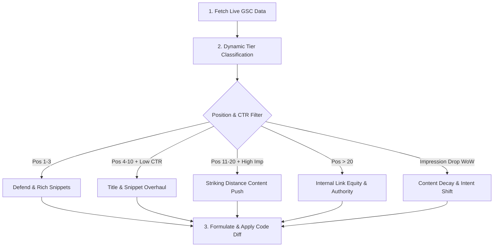

# EUNACOM SEO Growth Engine & Audit Skill

Use this skill whenever analyzing organic search traffic from Google Search Console, evaluating ranking opportunities, diagnosing drops or indexation anomalies, and executing data-driven SEO optimizations across `eunacom-app-v2`.

---

## 1. Principles of Dynamic SEO Evaluation

Do **not** rely on hardcoded assumptions or static recommendations. Every search environment evolves dynamically. The agent must evaluate the current live data from Google Search Console using this decision engine:



---

## 2. Dynamic Decision Engine Rules

When evaluating GSC rows `(query, page, clicks, impressions, ctr, position)`:

### Rule 1: High-Impression Striking Distance (`4.0 <= position <= 20.0`)
* **Trigger Condition**: Impressions are in the top 20% of all site queries, but ranking is just off top 3.
* **Diagnosis**: Google understands the page relevance, but competitors have better depth, schema, or keyword coverage.
* **Dynamic Action**:
  1. Inspect the specific search queries associated with this landing page.
  2. Extract the exact missing phrases (e.g. specific medical guidelines, exam dates, syllabus codes).
  3. Enrich the page copy and H2 headings with those terms.

### Rule 2: Underperforming CTR Gap (`position <= 10.0` AND `ctr < 3.5%`)
* **Trigger Condition**: Ranked on Page 1, but users click competitor listings.
* **Diagnosis**: Weak title tag, vague meta description, or missing Schema Rich Results.
* **Dynamic Action**:
  1. Rewrite `<title>` to front-load high-intent triggers (e.g. Numbers, Year "2026", Official syllabus).
  2. Add Schema.org `FAQPage` or `Course` JSON-LD to claim extra vertical pixels in SERP.

### Rule 3: Content Decay & Drop Detection (`WoW Impressions < -25%`)
* **Trigger Condition**: Page impressions dropped significantly compared to previous 28-day window.
* **Diagnosis**: Outdated medical information, broken internal links, or intent shift.
* **Dynamic Action**:
  1. Audit canonical and index tags on the route.
  2. Check if search demand shifted to a newer query variant.

### Rule 4: Domain & Indexation Health
* **Trigger Condition**: Traffic fragmented across multiple host variants (`eunacomapp.cl` vs `www.eunacomapp.cl` vs `http://`).
* **Diagnosis**: Split PageRank and keyword cannibalization.
* **Dynamic Action**: Ensure permanent 301 redirects in `vercel.json` and strict canonical tags in `scripts/prerender-seo.js`.

---

## 3. SEO Execution Protocol (Step-by-Step)

### Step 1: Pull Fresh GSC Metrics
```bash
python3 scripts/gsc_seo_analyzer.py --days 28 --json
```

### Step 2: Dynamically Compute Gaps
Parse the output and calculate:
- Top 10 queries driving clicks vs top 10 queries driving impressions without clicks.
- Striking distance landing pages sorted strictly by opportunity score `(Impressions * (1 / Position))`.
- CTR anomalies on page 1 URLs.

### Step 3: Propose & Apply Tailored Code Adjustments
Based on what the data **actually** shows:
1. Modify title tags and meta descriptions in [`scripts/prerender-seo.js`](file:///Users/felipeyanez/Desktop/NEWeunacom/eunacom-app-v2/scripts/prerender-seo.js) and [`src/lib/seo.js`](file:///Users/felipeyanez/Desktop/NEWeunacom/eunacom-app-v2/src/lib/seo.js).
2. Insert valid Schema.org structured data (`FAQPage`, `Course`, `MedicalWebPage`).
3. Add contextual anchor links between blog articles and high-opportunity landing pages.

### Step 4: Verification
1. Run `npm run build` in `eunacom-app-v2/` to ensure all routes prerender cleanly with valid HTML.
2. Update the daily briefing in `os/daily-briefs/` with the live snapshot and applied optimizations.
