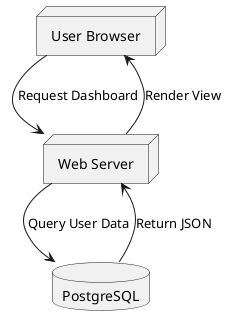

# PlantUML Architect

This skill enables Claude to author highly technical, formal UML diagrams (structural or behavioral) and deliver them as instantly viewable SVG images by transparently compiling the code against the public Kroki API.

## When to Use This Skill

- The user asks for a strict Unified Modeling Language (UML) diagram.
- The user requests a "Sequence diagram", "Class diagram", "Component network", or "Use case diagram".
- The user specifically requests "PlantUML", "Kroki", or "SVG diagram from code".
- The hierarchy is extremely complex and not suited for simple mind maps or manual whiteboarding.

## How to Execute the Workflow

### 1. Author the PlantUML Source Code
Produce the PlantUML syntax enclosed in `@startuml` and `@enduml` blocks.
Ensure you strictly follow Sentence Case for all text labels, nodes, and action descriptions.
Example structure:


### 2. Save the Source Code Locally
Save the generated raw PlantUML code to a fast temporary file inside the `diagrams/` folder of this skill, for example: `diagrams/diagram.puml`.

### 3. Generate the Hosted Image Link
The final deliverable should NOT be raw code strings, but a working, visual image. To achieve this cleanly and efficiently, use the bundled URL generation script provided with this skill.

**Command to execute:**
Execute the custom standalone script located in the `scripts/` folder using the `run_command` tool. Point it to the file in the `diagrams/` folder:
```bash
node "C:\Users\FL2024\.gemini\antigravity\skills\visual-diagramming-export\plantuml-architect\scripts\generate_url.js" "diagrams/diagram.puml"
```
*(Note: If the terminal returns an error like "node is not recognized", you MUST stop and run `node c:\Users\FL2024\.gemini\antigravity\skills\visual-diagramming-export\scripts\start-skill.js` to trigger the installation wizard for the user).*

### 4. Provide the Visual Output
Take the generated URL returned by the terminal script execution and present it to the user.
Use standard Markdown image syntax to embed the visual result directly in the chat:
``

Also, optionally offer to refer them to the `diagrams/diagram.puml` source file so they can edit it manually in their IDE if they wish.
