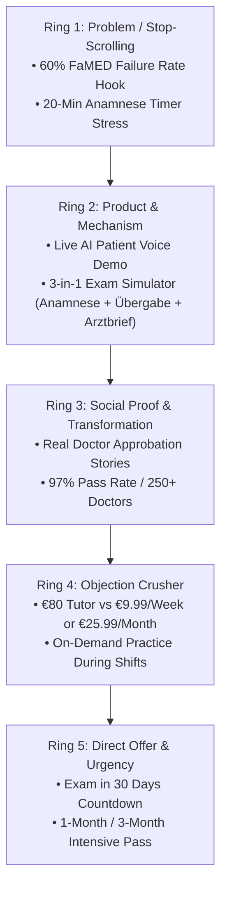

# 🎯 FaMED Test Prep — Meta Ads 5 Olympic Rings Blueprint

**Methodology**: Charley Tichenor IV ("The Olympic Rings Method" & 3:2:2 Flexible Dynamic Creative Testing)  
**Product**: FaMED Test Prep (`famedtestprep.com`) — German Medical Language Exam Preparation  
**Target Audience**: International Medical Graduates (Foreign Doctors) preparing for Approbation in Germany  
**Pricing Anchor**: 1-Week Sprint: **€9.99** | 1-Month Intensiv: **€25.99** (€0.86/day) | 3-Months: **€69.99**  

---

## ⭕ The 5 Olympic Rings Funnel



---

## 🎬 Complete 3:2:2 Ad Matrix by Ring

### 🔴 Ring 1: Problem & Hook (Stop the Scroll)
* **Goal**: Disrupt the feed of foreign doctors and tap into the core fear of failing the FaMED Test.
* **Creatives (3)**:
  1. `R1_C1_UGC` (Video 9:16): Doctor speaking outside German clinic: *"Warum fallen so viele Ärzte beim ersten FaMED-Test durch?"*
  2. `R1_C2_DEMO` (Video 9:16): Screen recording of 20-min Anamnese countdown timer with highlighted red grammar slips.
  3. `R1_C3_STATIC` (Image 1:1): High-contrast card: *"FaMED-Prüfung 2026: Höre auf, medizinische Lehrbücher auswendig zu lernen wie Vokabeln."*
* **Primary Copies (2)**:
  * **Text A (Empathy Story)**: *"Du hast jahrelang Medizin studiert. Du kennst Diagnosen, Dosierungen und Leitlinien. Doch im FaMED Test entscheidet deine spontane Gesprächsführung mit dem Patienten..."*
  * **Text B (Direct Value)**: *"Kein deutscher Tandempartner für den FaMED Test? Private Nachhilfe zu teuer (€80/Stunde)? FaMED ist dein 24/7 Simulator für die FaMED-Prüfung. Ab nur 9,99 € für 1 Woche oder 25,99 € für den ganzen Monat."*
* **Headlines (2)**:
  1. *"FaMED Test beim 1. Versuch bestehen 🚨"*
  2. *"Der #1 Simulator für die FaMED-Prüfung"*

---

### 🟠 Ring 2: Product & Mechanism (How FaMED Works)
* **Goal**: Demonstrate the AI patient speech engine, instant grading, and Arztbrief corrector.
* **Creatives (3)**:
  1. `R2_C1_VOICE` (Video 9:16): Doctor presses mic, speaks to AI patient 'Herr Meier', instant grammar feedback appears.
  2. `R2_C2_3IN1` (Video 9:16): 3-Part Exam Simulator Walkthrough (Station 1: Anamnese ➔ Station 2: Übergabe ➔ Station 3: Arztbrief).
  3. `R2_C3_PROTOKOLL` (Image 1:1): Interactive case protocol explorer with 50+ official examination cases.
* **Primary Copies (2)**:
  * **Text A (Walkthrough)**: *"So funktioniert die FaMED-Vorbereitung: 1. Fall wählen, 2. Live-Anamnese per Spracheingabe, 3. KI-Feedback zu Grammatik & Fachbegriffen, 4. Arztbrief verfassen. Trainiere wann und wo du willst ab 0,86 € / Tag."*
  * **Text B (Features)**: *"✨ 50+ authentische Patientenfälle ✨ Sofortige KI-Sprach- & Grammatikanalyse ✨ Verifizierte FaMED Protokolle ✨ Jetzt unverbindlich ausprobieren!"*
* **Headlines (2)**:
  1. *"Live-Demo: KI-Patienten für den FaMED Test 🎙️"*
  2. *"Trainiere für die FaMED-Prüfung 24/7"*

---

### 🟡 Ring 3: Social Proof & Transformation (Trust & Believability)
* **Goal**: Build undeniable trust using real doctor success stories and certificates.
* **Creatives (3)**:
  1. `R3_C1_TESTIMONIAL` (Video 9:16): Doctor in hospital scrubs holding passed FaMED exam certificate.
  2. `R3_C2_MONTAGE` (Reel 9:16): Rapid montage of real WhatsApp & Telegram celebration messages from doctors.
  3. `R3_C3_STAT` (Image 1:1): Trust badge: *"4.9 / 5 Sterne von über 250+ Ärzten – 97% Erfolgsquote im FaMED Test."*
* **Primary Copies (2)**:
  * **Text A (Case Study)**: *"„Beim ersten Mal bin ich im FaMED Test durchgefallen, weil ich im Arzt-Arzt-Gespräch blockiert war. Mit FaMED habe ich täglich 20 Minuten mit den KI-Patienten trainiert. Bestanden beim zweiten Versuch!“ — Dr. M."*
  * **Text B (Authority)**: *"Über 250 ausländische Ärzte haben die FaMED Sprachprüfung mit unserer KI-Plattform erfolgreich bestanden. ⭐ 97% Erfolgsquote bei aktiven Nutzern."*
* **Headlines (2)**:
  1. *"„FaMED Test beim 1. Versuch bestanden!“ ⭐⭐⭐⭐⭐"*
  2. *"97% Erfolgsquote bei der FaMED-Prüfung"*

---

### 🟢 Ring 4: Objection Crusher (Friction Elimination)
* **Goal**: Destroy hesitations around tutoring costs, state-specific exams, and busy hospital shifts.
* **Creatives (3)**:
  1. `R4_C1_VS_TUTOR` (Image 1:1): Comparison table: *1 Hour Tutor (€80) vs. Entire Month of Unlimited FaMED (€25.99)*.
  2. `R4_C2_WEEK_PASS` (Image 1:1): *Prüfung nächste Woche? 7 Tage Vollzugriff für nur 9,99 €*.
  3. `R4_C3_BUSY` (Video 9:16): Doctor practicing a quick 10-minute Anamnese case on mobile during clinic coffee break.
* **Primary Copies (2)**:
  * **Text A (Price Justification)**: *"Eine einzige Nachhilfestunde kostet zwischen 60€ und 90€. Ein teurer Vorbereitungskurs über 1.200€. Bei FaMED zahlst du für einen ganzen Monat unbegrenzte KI-Patienten nur 25,99 € (oder 9,99 € für eine Woche)."*
  * **Text B (Time Efficiency)**: *"Vollzeit im Krankenhaus? Trainiere 15 bis 20 Minuten am Tag mobil mit FaMED und gehe optimal vorbereitet in den Test."*
* **Headlines (2)**:
  1. *"Günstiger als 1 Stunde Nachhilfe (ab 9,99 €) 💡"*
  2. *"FaMED Vorbereitung für 0,86 € am Tag"*

---

### 🔵 Ring 5: Direct Offer & Urgency (The Close)
* **Goal**: Trigger immediate purchase for doctors who have an exam scheduled in the next 30–60 days.
* **Creatives (3)**:
  1. `R5_C1_COUNTDOWN` (Motion Graphic 9:16): Calendar flipping with exam countdown: *"FaMED-Prüfung in 30 Tagen? Jetzt zählt jede Simulation."*
  2. `R5_C2_BUNDLE` (Image 1:1): *3-Monate FaMED Prüfungs-Prep: Nur 69,99 € (statt 129,99 €)*.
  3. `R5_C3_WEEK_SPRINT` (Image 4:5): *Starte jetzt für nur 9,99 €: Voller Zugriff auf alle 50+ FaMED-Fälle*.
* **Primary Copies (2)**:
  * **Text A (Urgency)**: *"Ein Durchfallen beim FaMED Test bedeutet oft 3 bis 6 Monate Wartezeit auf den nächsten Termin. Sichere dir heute den 1-Monats-Zugang für nur 25,99 € oder das 3-Monate-Paket für 69,99 €."*
  * **Text B (No Risk)**: *"Teste FaMED jetzt kostenlos oder wähle den 7-Tage-Sprint für nur 9,99 €. Überzeuge dich selbst vom sofortigen Korrektur-Feedback."*
* **Headlines (2)**:
  1. *"FaMED Test in Sicht? Ab 9,99 € vorbereiten 🎯"*
  2. *"1 Monat unbegrenzt für nur 25,99 €"*

---

## ⚡ Execution Commands
```bash
# In famed-offline repo:
npm run ads:generate       # Generates Meta Ads CSV and JSON
npm run ads:scrape         # Opens competitor spy dashboard
```
